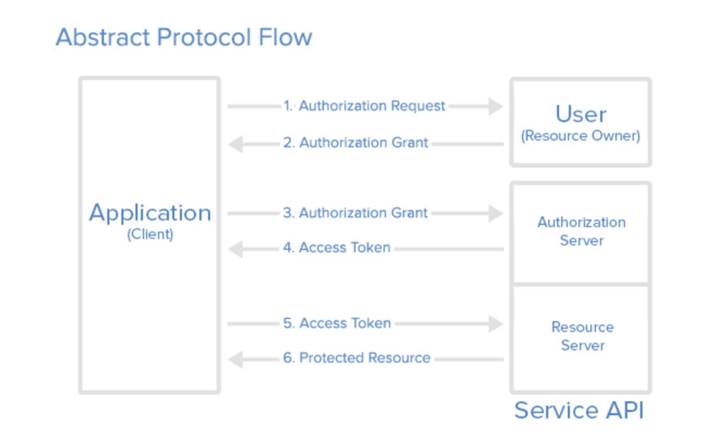
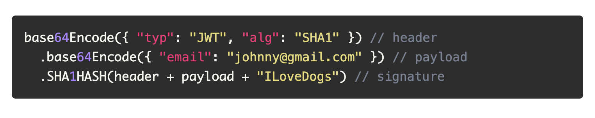
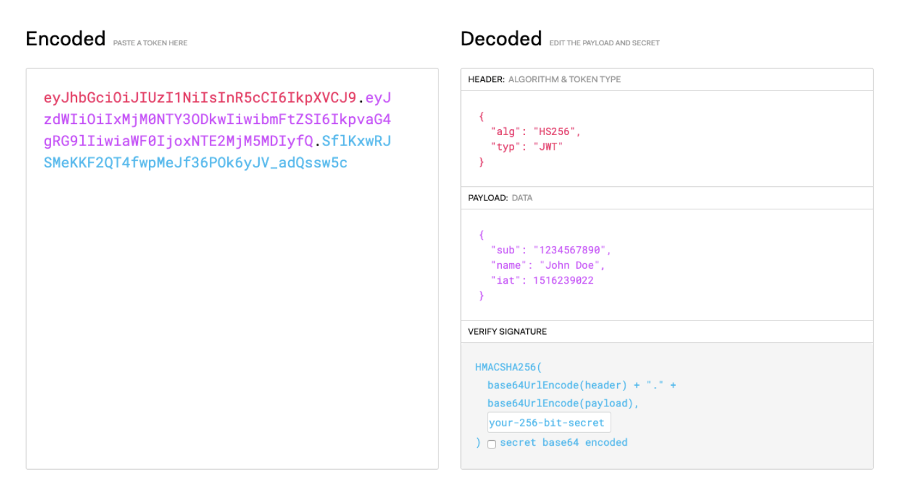

# OAuth
- helps with password fatigue (watch video for reference)
- allow a third party to do things for you.  Talk about chase banking example from the readings

- other oauth services include: 
    - oath 1.0
    - facebook connect
    - SAML
    - Mozilla Peersona 
    - Microsoft passport, .net
### how your app collaborates with OAuth provider

- OAuth is a standard that allows an app to access data from a third-party without providing credentials directly

[https://en.wikipedia.org/wiki/List_of_OAuth_providers](https://en.wikipedia.org/wiki/List_of_OAuth_providers)



### steps

1. redirect your app to OAuth login page (github, google, etc...)
2. Handle redirect from OAuth server
3. use code from OAuth server to POST a request to special auth token endpoint
4. get the auth token from the response
5. send the auth token in subsequent requests, either through the header or cookies

### JWT

- sections
1. header — type of token, signature algo

    ```jsx
    {"typ": "JWT", "alg": "HS256"}
    ```

2. payload —  data we want to store in the jwt
3. signature — header + payload + secret are hashed





# JWT code example 

for this code example please take a look at the jwt_auth_finish branch in breaddit_lecture repo.  You can find it in carlosaicrag repository.  If you want to transfer it and have it be your own repo you can do that as well.

1. breakdown new folder structure that include a new router that has the /home route and /authorized_home route

* currently users will be able to go to /home and /authorized_home.  By the end of the lecture users should only be able to go to authorized_home if they are logged in 

* make sure that you have the correct environment variables in the .env file.  You have have a secret key variable and a time limit variable.

* This demo will be using postman because you will have to manually place the token in the headers of postman 

* This demo is following the steps from the homework readings the night before (Token-based Authentication)

* start the demo with creating the get user auth function in the auth.js file that will be located at the root of the directory.  If the auth.js file is not there then go ahead and craete it 

* then change the code in the /signup route of the users router (to sign up a user) that will allow you to send a response json of the user and the token that was generated

* use postman to test that you're able to get the token 

* implement require auth method in the auth.js file

* make sure that you export the the get token function from the auth.js file and the array of middlewares. 

* you will be using the array of middlewares to include in the authorized_home route of the routes file. 

* go ahead and include the array of middle wares in the authorized home route and make sure that you place the token that you received from the /signup route as a value to the key Authrorization in postman.  Please reference the jwt readings from the night before if you don't know what i'm talking about. 
